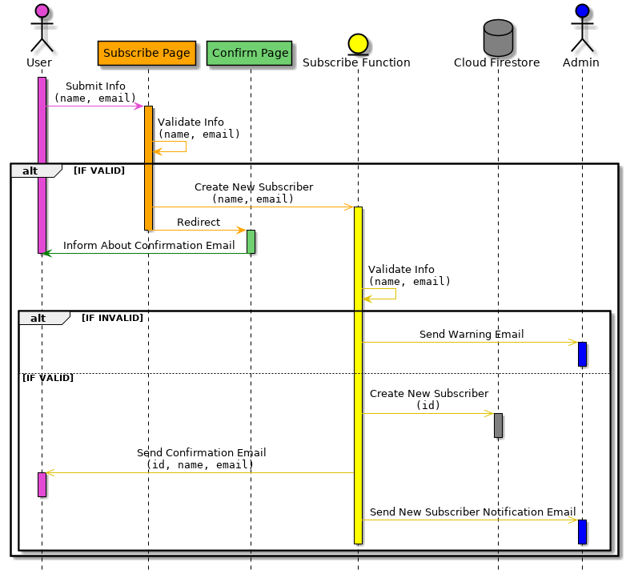
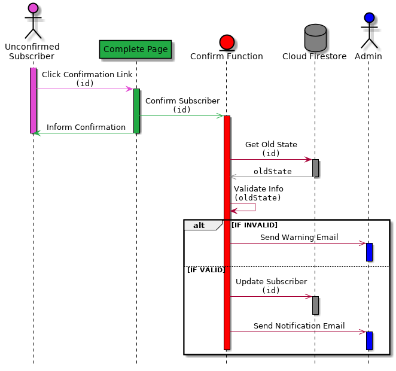
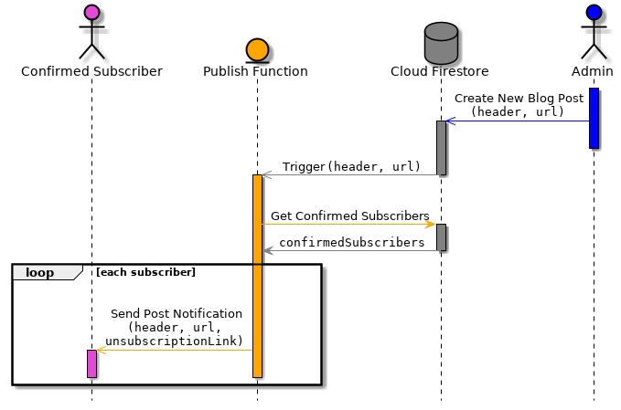
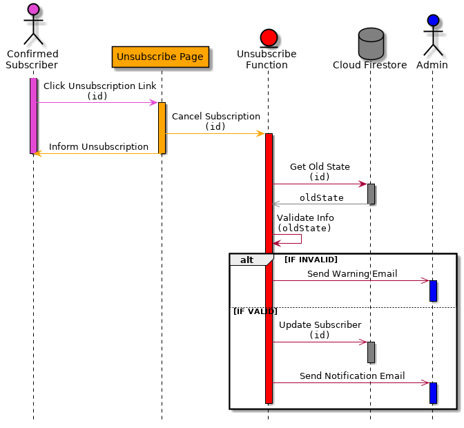

# subops
Manages subscriber operations for [my blog](https://utkuufuk.com).

## Serve Functions Locally or Deploy to Cloud
Serve functions locally without deploying functions to cloud:
``` sh
# default port is 5000
sudo firebase serve --only functions --port=5123
```

Deploy functions to cloud:
``` sh
npm run deploy
```

## Configuration
### Set Remote Configuration
```sh
# set admin username & password
firebase functions:config:set admin.email="utkuufuk" admin.password="ilikebananas"

# set website url
firebase functions:config:set blog.website="https://utkuufuk.com"
```

### Retrieve Current Envvironment Configuration
```sh
firebase functions:config:get
```

### Import Remote Configuration to Local Environment
```sh
firebase functions:config:get > functions/.runtimeconfig.json
```

## Sequence Diagrams
### Subscription


### Confirmation


### Blog Post Notification


### Unsubscription

